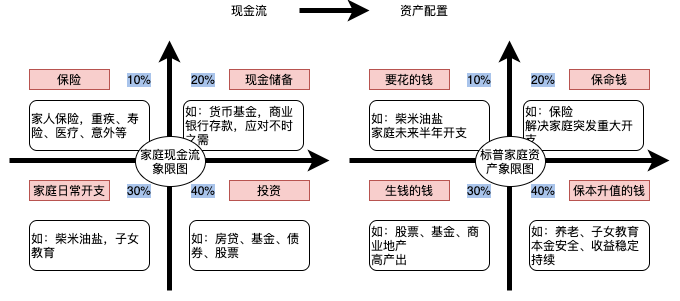

# chp01 家庭资产配置

认真工作，用双手创造价值获取回报，最初自己才是最可靠的资产，用保险对冲风险，为家人增添一份生活保障，将凭工作获得的资本再投资，两个方向上持续获得收益。随着时间的推移，人的年纪增大，不可避免的是体力和精力衰退，再加上技术更新换代，人的思维模式固化，对大多数人而言工作获取的主动收入总会随着时间推移将会达到巅峰进而下降，这时被动收入就变得尤为重要，被动收入可以是著作权、专利、房租、基金和股票资本利得等收入。一边是家庭开支一边是投资，这就涉及到家庭现金流，所以投资之前先规划好家庭开支，再决定将钱投资于房产、还是权益市场，一个良好的家庭资产配置能够抵抗家庭变故、投资失败等一些重大黑天鹅事件，节约应该是时刻该做的。

现在社会的物质非常丰富，产能过剩严重，只有钱不断流动起来，不断消费才能给社会经济创造价值，消费主义就被这个社会扶正了。时间才是最贵的，把时间花在家人和自己的身上才是最有意义的。

还有不要迷恋那种会花钱才会赚钱的毒鸡汤，吃喝玩乐是消费不是会花钱，一切表象的背后都是利益，真正会花钱的人是把钱花在资产上，涨知识，提高技能，让钱增值，这些都是在增加资产，这种花钱是投资，这种才是真正的会花钱才会赚钱，商家会采用各种方法掏空消费者，包括调研用户，包括习惯、心理，消费水平、情绪等，宝洁甚至聘请耶鲁大学的心理学教授分析用户调查结果。数据挖掘，营销手法。拥有攀比心的我们很容易掉入这样的陷进中。

一个人真正的改变源于自身的改变，源于底层思维和认知的改变，越是在一个思维和认知体系里呆的越久就越难改变，有时这种改变是无法改变的。一种投资方法可能一时奏效，但这种方法所采取的行动最终会改变环境，环境的改变则意味着要采取新的方法，而且一种方法如果被其他人模仿，其效用值也会降低。所以请保持开放心态，持续学习。

普通人实现财务自由应遵循的六大原则：辨别与忽略那些关于财富与收入的神话；了解周围的人如何影响你的财务行为；以自己的生活方式来生活；建立一套自己的积累财富行为；寻找能够兼顾经济与生活方式自由的职业和机会；不断获取投资与增长财富的相关知识。

对于家庭而言分为有形资产和无形资产，主要分为钱生钱类，如银行存款、债券、信托和P2P等；物生钱类，如房产、股票、基金、土地等，物品类，如黄金、大宗商品、艺术品、古董等。无形资产包括教育、著作权、专利、个人时间等，其价值和回报比较难以估量，比如子女的教育投资，有形资产包括用于出租的房产、带来正向现金流的出租车等。

根据家庭收入实际情况、理财目标、风险承受能力以及生活质量要求，调节舒适的比例配置现金流和资产，管理控制风险，让损失降到最低。也可以根据目标将可选消费降级，必选消费3~6个用量批发采购；如果记账之后发现支出不合理，可以采用定投强制储蓄，选择合适的投资标的（银行存款、基金等），投资于可以产生现金流的资产，这样长期收益才更高。　

## 保险

保险的目的是风险对冲，买保险源于忧患意识和责任意识，知道保险作用而不买源于侥幸心理。保险购买顺序，终生重疾，人寿，医疗和意外险，这四种就可以了，家庭支柱尽早买，不要等到身体出状况买不了了才想起来，那时已经晚了。保险作为一种风险对冲工具，其最大的价值在于保险而非理财，不建议买返保费型的。

家底比较殷实可以考虑给小孩购买重疾和医疗等。

## 房子

一二线城市的房子绝不仅仅只具有住的属性，城市的集中化导致了医疗、教育、交通、商业资源相对集中化，而房子地理位置提供了享有这些条件的便利性，“就近上学”使得就算不考虑便利性，只要不在教育局所划分片区就享受不了房子就近的学区。所以每个想在城市立足的人，都应该慎重的考虑考虑这个问题，我想大多数和我一样，从农村走出来的孩子，刚工作时面临是生存压力，父母们也没有这方面经验，都是等到不得不考虑这个问题了才考虑，需求是什么？居住、保值、学区？然后根据需求选择房子（除非很有钱，否则大多数情况下可选项很少）。供需关系决定价格，人口是供需关系的来源，所以看房价就看一条，房子周边的环境，短期、中期和长期人口流动情况怎样？这些流动人口的购买力怎样？只要购买力强的人口大量流入害怕没有配套的商业？没有配套的交通？但是要看你的需求，你是一年投资（配套要完善），还是十年投资是不一样的。所以希望这能引起大家的思考，影响房价的人口供需关系只在人口具备潜在购买力阶段，当前一线城市有些自己戏称北漂、沪漂的一族已不再影响当地的房价，但是一线的城市房价依然 坚挺，这是由于政府为了发展经济、增加就业、稳定社会，倾向于保持微通胀的状态，货币的超发在现代金融体系和财政体系中不可避免，只要房价限购各项政策取消，一二线房价必将迎来暴涨，这是因为有钱的人很多，可以买的起很多套房子的人很多，但是国家现在的政策限制着呢，不让买，所以是政策原因导致了供需畸形，尽管如此，前言里所说的贫富差距变大依然在加速，所以一二线好地段的房子终将和大多数没有关系，正如当前名字画一样。

我建议是对于首套房以及刚改需求而言，不要做傻空，经济可以承受的范围内，先落袋为安，尽力一步到位，想要再换房，难度还是比较大的。

每个城市都有口口相传的好学区，升学率、生源、师资等这些资料很容易获得，对于老破小的学区我觉得要慎重，毕竟00后对居住品质的要求还挺高（80后的我也不会考虑老破小），可以考虑新建的名校分校。学区固然重要，但是也不是那么重要，对于老师而言，不论是名校或非名校，教师只是一份领薪水的工作，很多人都曾干过类似领薪水的工作，自己有多用心，教师也就有多用心，教师的影响力有限，比不上同学玩伴，同学之间的兴趣爱好、攀比、异性吸引等都对小孩产生重大的影响，好学校，周边朋友、同学更优秀的概率会大一些，毕竟有句古话“龙生龙、凤生凤，老鼠的儿子会打洞”，父母对孩子的影响最大（接触的时间也最长），所以父母有必树立正确的价值观、人生观、世界观，多关系小朋友，而不是多关心小朋友的成绩。

## 金融资产

投资的本质是认知的变现，是对政治、宏观经济、中观行业、微观商业、人性以及自己的认知变现，建立自己的理财框架思维，宏观国际局势，国家政治、经济、文化，中观行业格局、产业技术、上下游产业链，微观企业战略、商业模式、管理、财务、产品以及营销等；每个人性格、经验、学识、认知和能力决定了其最适合的投资方式，认知自己能力圈，不再自己风险承受范围内的投资标的不要嘴馋，坚决不碰。

投资是拉长时间维度的投机，本质上都是低吸高抛，投机更倾向于短时套利，投资更倾向于长期增值，请区别投机和赌博，赌博是闭眼摇色子，而投机是参考各种数据和信息综合个人投资理念和框架得出的行为，投机就一定有风险，请做好损失本金准备，出于风险考虑，必须要有一个稳定的工作，并且前期不动用账户的利润，只有这样才能慢慢的把资金量滚起来，这就是稳定获利的秘密，而这个秘密背后的核心就是心态。

投资最先应该做的是记账而不是购买权益类资产，记账的目的是帮助我们做财务规划，提供尽可能全面的数据，没有明确目标的流水账，也将是毫无意义的。其次设立合适的投资回报观念，不要听信动不动一年翻倍的报道，明白年化10%，20%在这个世界投资回报所处的位置；没有计划性的用钱，习惯大手大脚的人，一定无法让财富持续下去，因为钱是一笔一笔攒出来的，不管你能赚多少钱，在这个世界上一定总有相等价格的东西让你购买。4.建立一个就算天塌了也可以让你维持生计的资产；不论通过投资赚了多少钱，只要有一次规模相当的失误，很有可能前面的积累就会功亏一篑，很多富人返贫就是这样的。

不论是价值投资还是价值投机，把握时机非常重要，是投机成功的首要因素。在投资领域里需要老老实实做好投资总结，独立思考，切实根据实际情况做出交易策略，不可自欺欺人，不能有半点虚假成分。把握时机、管理资金以及控制情绪，投机不是赌博。空杯心态非常重要，凯恩斯说“介绍新观念倒不是很难，难的是清除那些旧观念”，持续学习，唯有如此，才能不断发现适应市场规则的新环境。

没钱不要浪费时间理财，这个阶段时间最重要，投资自己的智力，见识，能力和身体健康，读书是一个人离开学校之后主动学习能力的体现，投资自己考虑自己所做的每件事的稀缺性和机会成本，成为工作行业的专家，收入自然会上来，自然有理财的钱。

赔掉的钱要在自己承受能力内（应该用闲钱），站在未来的角度看现在，都是必要的，这是技能投资，这些损失会让你学会思考。知道自己几斤几两，不要和别人比较，这样不至于走弯路。

性格决定命运，心理决定输赢，投资的第一步是看风险而不是收益，保持长期投资的心态，不要负债投资金融资产，以免受利息所累，而且长期投资中难免有盘整或下跌行情，闲钱投资心情较为平静，不为短期套牢所苦。

少就是多，慢就是快，构建属于自己的稳健、均衡极简组合，长期盈利并不需要很复杂的策略，在各个周期中配置合理的仓位，就可以把投资做的很少，精学、学精指数，两鸟在林，不如一鸟在手，能拿得住的才是自己的。

长期积累和增长财富的能力由你的行为塑造，而不是你头脑中的想法，行动大于想法。

金融资产包括货币基金、短期定投（三个月、六个月）以及债券股票基金等，对于股权、期权等。

### 资产配置

入市首选宽基指数，买个股获利需要同时满足四个条件：押对行业、押对个股、重仓以及吃全主升段，这很需要经验、技能和耐心，此外窄基（选行业、板块基金）难度也较大，相比之下宽基指数确定性强一些，这个确定性是指跟随市场大势（国运）的确定性，只要相信市场长期是涨的，不妨摒弃超额收益的想法，选择宽基指数做仓底，先保证自己能完全跟上全市场收益，待自己能力提升之后，再使用仓位管理、配置动态再平衡、适度轮动、量化交易实现超额收益，选择宽基指数不需要大量时间研判行业、公司基本面等细节上，只需要关注仓位水平这一个变量，根据所处牛熊周期调节仓位即可，这是风险、时间、投资框架以及财富增值的最优选择。

宽基指数的初衷是覆盖全市场，在这一目的之下，选择沪深300和中证500较为合适，沪深300是从沪深两市选择市值最大且流动性最好的前300只股票组成的指数，占全市场3600家公司的比例为前8%，覆盖了全市场过半的市值，其特点是大中盘、偏蓝筹、市值头部企业，沪深300第一权重是金融地产占40%，美国的标普500前三大权重是信息技术、消费和医药；中证500是剔除了沪深300之后，总市值靠前的500家股票，覆盖了全市场约15%的市值，其特点是相对小市值但又不是太小，平均市值近200亿，是细分行业的小龙头，还在成长中，优胜劣汰，属于成长性强的指数；沪深300长期年化收益率达到10+%。

入市选择的基金不易多，限定在6只以内，沪深300、中证500、消费、医药、以及超低估非夕阳产业，也可以增加纳指或者创业板指数等，可以通过动态再平衡和估值水位再平衡等方法进行仓位调节，并不是说现在立马进入消费和医疗，还是要看宏观基本面，看估值水位，看行业趋势等。

### 股债平衡

国内投资渠道匮乏，容易赚钱的项目多半轮不到你我这样的普通人，股市内幕比较多，处罚又没有西方国家厉害，因此股市投资对于很多新手而言风险是比较高的，所以这个时候除了货币基金，选择一个低风险的金融投资品种就显得非常有意义。货币基金的收益率一般比较低，所以选择纯债基金是一个比较不错的选择。定期定额选择股债平衡是个不错的选择。

个股财报不可信，资讯太落后，内幕消息拿不到，

纯债基金选择要注意四个方面：

1.成立时间大于等于5年；

3.基金规模大于等于